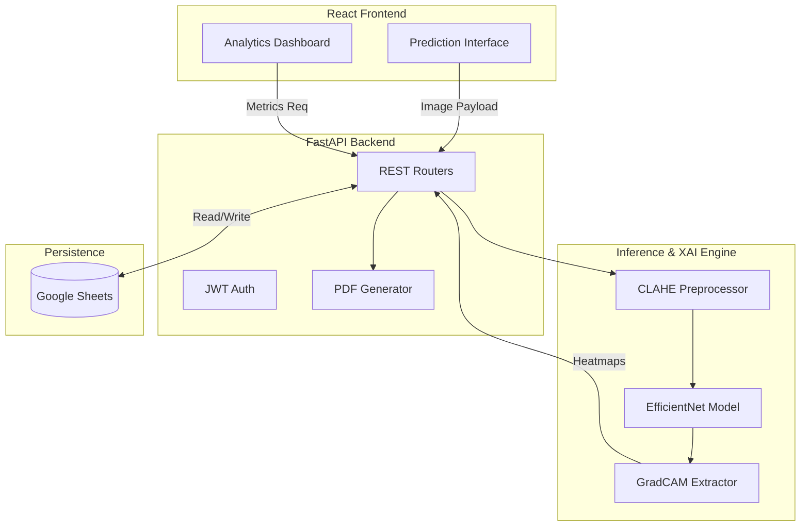

<div align="center">

```text
██████╗ ███████╗████████╗██╗███╗   ██╗███████╗██╗  ██╗     █████╗ ██╗
██╔══██╗██╔════╝╚══██╔══╝██║████╗  ██║██╔════╝╚██╗██╔╝    ██╔══██╗██║
██████╔╝█████╗     ██║   ██║██╔██╗ ██║█████╗   ╚███╔╝     ███████║██║
██╔══██╗██╔══╝     ██║   ██║██║╚██╗██║██╔══╝   ██╔██╗     ██╔══██║██║
██║  ██║███████╗   ██║   ██║██║ ╚████║███████╗██╔╝ ██╗    ██║  ██║██║
╚═╝  ╚═╝╚══════╝   ╚═╝   ╚═╝╚═╝  ╚═══╝╚══════╝╚═╝  ╚═╝    ╚═╝  ╚═╝╚═╝
```

**RetiNex AI** — Research-Grade Explainable AI Platform for Diabetic Retinopathy

[](https://fastapi.tiangolo.com/)
[](https://reactjs.org/)
[](https://tensorflow.org/)
[](https://www.docker.com/)

An end-to-end medical AI system combining deep learning, clinical explainability, and modern full-stack engineering to classify diabetic retinopathy from retinal fundus images.

</div>

---

## 📸 Demo

<div align="center">
  
  <br/>
  <i>Platform analytics and user evaluation dashboard.</i>
  <br/><br/>
  
  
  <br/>
  <i>AI inference hub with severity grading and confidence distributions.</i>
  <br/><br/>

  <div style="display:flex; justify-content:center; gap: 10px;">
    
    
  </div>
  <i>(Left) GradCAM clinical evidence heatmaps. (Right) Confusion matrix evaluating class imbalance.</i>
</div>

---

## 🔬 Project Overview

Diabetic Retinopathy (DR) is a severe complication of diabetes that damages the blood vessels of the retina, standing as a leading cause of preventable blindness. Deep learning models can achieve high accuracy in DR detection, but they are often deployed as "black boxes." In medical AI, trust is paramount; a clinician cannot blindly accept an algorithm's classification without understanding *why* that decision was made.

**RetiNex AI** solves this by structurally integrating **Explainable AI (XAI)** into a modern application stack. Instead of simply outputting a severity score (0 to 4), the platform generates GradCAM attention heatmaps that highlight the exact microaneurysms, hemorrhages, and hard exudates driving the model's prediction. 

This project is a technical bridge between raw TensorFlow model pipelines and a polished, production-ready React/FastAPI medical platform.

---

## ⚡ Key Features

Built from scratch with actual engineering implementations, not just mockups.

* **Retinal Preprocessing Engine:** Automated black-border cropping and Contrast Limited Adaptive Histogram Equalization (CLAHE).
* **High-Performance ML Pipeline:** `tf.data` dataset pipeline with caching, prefetching, and dynamic augmentations (MixUp/CutMix).
* **EfficientNet Transfer Learning:** Optimized EfficientNet architectures with customized classification heads.
* **Clinical Explainability:** Native GradCAM implementation computing gradients directly from the final convolutional layers.
* **Imbalance Handling:** Implementation of Severity-Aware Focal Loss to penalize dangerous false negatives on severe DR cases.
* **FastAPI Backend:** Fully asynchronous, thread-safe AI inference service handling Test-Time Augmentation (TTA).
* **Google Sheets Database:** Lightweight, serverless JSON-key authenticated database wrapper (`gspread`).
* **Modern React Frontend:** Vite-powered SPA with Tailwind CSS v4 glassmorphic design and Framer Motion interactions.
* **Analytics & Reporting:** Interactive Chart.js dashboards and automated PDF clinical report generation via `reportlab`.

---

## 📐 System Architecture



---

## 🧠 ML Pipeline

The machine learning pipeline is strictly designed around the APTOS 2019 Blindness Detection dataset characteristics.

1. **Preprocessing (`preprocessing/preprocess_images.py`)** 
   Retinal images are vastly different in lighting and camera angle. The pipeline masks circular contours, crops out excess darkness, and applies CLAHE to equalize vascular contrast.
2. **Data Loading (`training/create_datasets.py`)**
   Uses `tf.data.Dataset` for asynchronous I/O. Images are loaded, decoded, resized to (299, 299), and batched.
3. **Augmentation (`training/augmentation.py`)**
   To combat overfitting, the pipeline applies random flips, rotations, and advanced label-smoothing techniques like MixUp and CutMix during the forward pass.
4. **Training & Loss (`training/train.py` & `training/focal_loss.py`)**
   The network optimizes a custom Focal Loss rather than standard Categorical Crossentropy to handle the extreme class imbalance (Class 0 heavily outweighs Class 4).
5. **Evaluation (`evaluation/` & `training/export_metrics.py`)**
   Generates test-set predictions, confusion matrices, and per-class F1-scores, exporting them to JSON for the frontend Research Dashboard.

---

## 📊 Current Results

*Authenticity matters in medical AI. These are the current unexaggerated metrics.*

* **Validation Accuracy:** ~77.2% (15 Epochs, APTOS validation split)
* **Macro F1-Score:** ~0.65 
* **Class 0 (No DR) & Class 2 (Moderate):** High precision and recall.
* **Class 1 (Mild) & Class 4 (Proliferative):** Demonstrates moderate confusion.
* **Inference Speed:** ~1.2s per image (end-to-end including GradCAM extraction and network overhead).

---

## 🚧 Current Limitations

This project is open-source and continuously evolving. Current known limitations include:

* **Severe DR Recall:** Due to severe dataset imbalance, recall on Proliferative DR (Class 4) remains challenging and is actively being researched.
* **Model Calibration:** Output softmax probabilities are not yet fully calibrated to represent true confidence percentages (requires Temperature Scaling).
* **Domain Shift:** The model is trained purely on APTOS 2019 data and may degrade when tested against unseen hardware sources (e.g., IDRiD or Messidor datasets) without domain adaptation.
* **GradCAM Resolution:** Heatmaps are upsampled from a 10x10 feature map, leading to generalized blob-like highlights rather than pixel-perfect segmentation.

---

## 🔭 Research Direction

Future technical objectives:

* **Ordinal Regression:** Shifting from standard categorical classification to ordinal regression to penalize predictions based on clinical distance (e.g., predicting 0 when true is 4 should be penalized heavier than predicting 3).
* **Ensemble Learning:** Combining EfficientNet with a specialized ResNet50 pathway to isolate vascular micro-features.
* **Cross-Dataset Robustness:** Expanding evaluation to Messidor-2 to benchmark true generalization.
* **ONNX Optimization:** Exporting the TensorFlow graph to ONNX for lighter, CPU-bound backend deployment.

---

## 📁 Folder Structure

```text
RetiNex AI/
├── backend/               # FastAPI, Auth, Reports, Services
├── docs/                  # API and Setup Documentation
├── evaluation/            # Confusion matrices and plots
├── explainability/        # GradCAM algorithms
├── frontend/              # React Vite SPA
├── metadata/              # Dataset CSV tracking
├── models/                # Saved .keras weights
├── preprocessing/         # Crop and CLAHE utilities
├── training/              # TF pipelines, losses, and fit loops
├── app.py                 # Backend entry point
└── Dockerfile             # Multi-stage production build
```

---

## ⚙️ Setup & Installation

**1. Clone & Install**
```bash
git clone https://github.com/BhavyaKansal20/RetiNex_AI.git
cd "RetiNex AI"

python -m venv venv
source venv/bin/activate
pip install -r requirements.txt
```

**2. Train the Model** (Requires APTOS data in `data/aptos/`)
```bash
python -m training.train
python -m training.export_metrics
```

**3. Start Backend**
```bash
python app.py
```

**4. Start Frontend**
```bash
cd frontend
npm install
npm run dev
```

---

## 💻 Tech Stack

| Domain | Technologies |
|---|---|
| **Machine Learning** | TensorFlow 2, Keras, OpenCV, Numpy, Scikit-learn |
| **Backend API** | Python 3.11, FastAPI, Uvicorn, Python-Jose, Bcrypt |
| **Database & Reports** | Google Sheets API (`gspread`), ReportLab |
| **Frontend Client** | React 18, Vite, Tailwind CSS v4, Framer Motion |
| **Data Visualization** | Chart.js, React-Chartjs-2 |
| **Deployment** | Docker, Docker Compose |

---

## ⚠️ Disclaimer

**This is a research project.** 
RetiNex AI is strictly built for educational, portfolio, and computer vision research purposes. It has **not** been approved by the FDA or any clinical regulatory body. It must not be used for actual medical diagnosis, treatment, or clinical decision-making. 

---

<div align="center">
  <b>Architected & Developed by Bhavya Kansal</b>
  <br>
  <a href="https://github.com/BhavyaKansal20">GitHub</a> • 
  <a href="#">LinkedIn</a> • 
  <a href="#">Portfolio</a>
</div>
